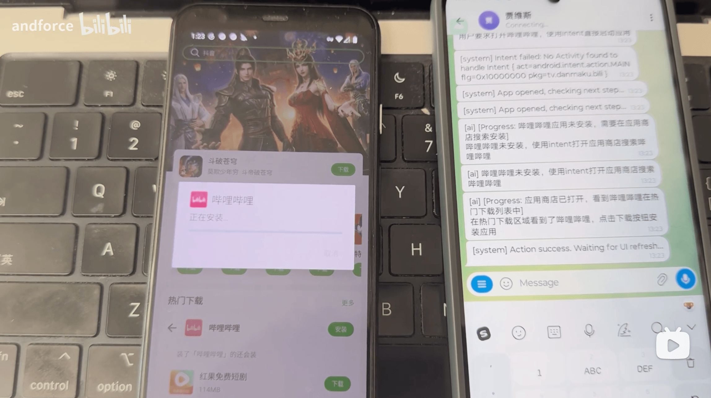
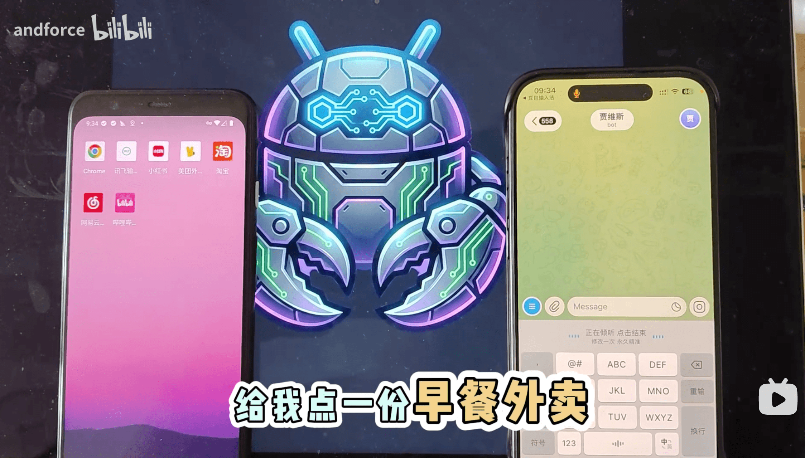
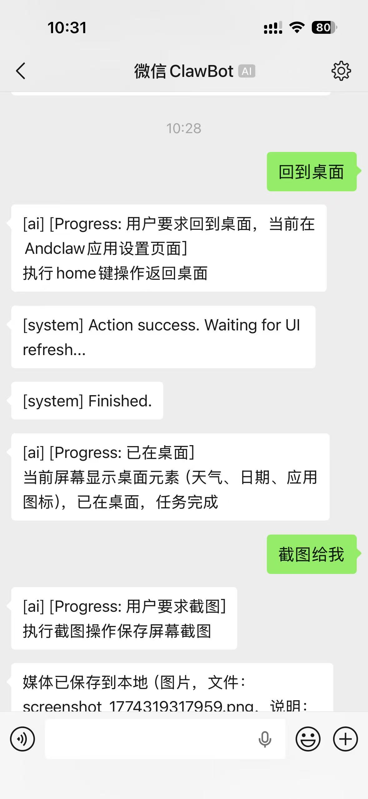
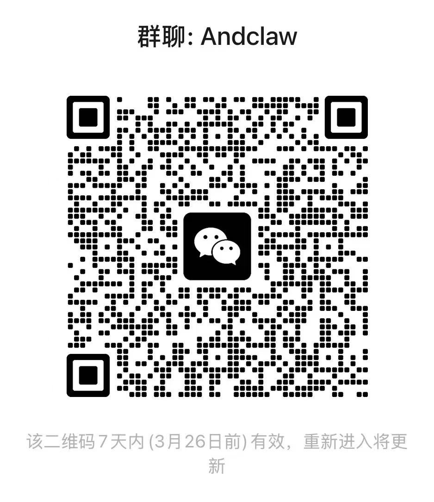

# Andclaw 🤖

<p align="center">
  
</p>

[](https://www.android.com/)
[](https://kotlinlang.org/)
[](LICENSE)
[](https://andclaw.app/)
[](https://andclaw.app/#/install)

> **让 AI 像人类一样使用你的手机** —— 完全在设备上运行，无需 Root，无需电脑。

<p align="center">
  <a href="https://andclaw.app/"><b>🌐 官方网站</b></a> &nbsp;|&nbsp;
  <a href="https://andclaw.app/#/install"><b>📲 在线安装 APK</b></a>
</p>

---

## 🌟 核心亮点

| 特性 | 说明 |
|------|------|
| **🚫 无需 Root** | 纯无障碍服务实现，不依赖系统权限 |
| **💻 无需电脑** | 完全在手机上独立运行，无需 ADB 或 PC 端配合 |
| **🧠 AI 驱动** | 支持 Kimi Code（Anthropic 格式）、Moonshot 和任意 OpenAI 兼容 API |
| **👁️ 屏幕感知** | 实时读取 UI 层次结构 + WebView/浏览器场景自动截图辅助视觉分析 |
| **🤏 拟人操作** | 模拟点击、滑动、长按、文本输入等手势操作 |
| **📸 多媒体能力** | 拍照、录像、录屏、截图、音量控制 |
| **📱 设备管控** | Device Owner 模式下支持企业级设备管理（静默装卸、Kiosk 等） |
| **🤖 远程控制** | **Telegram Bot** 或 **微信 ClawBot（基于 iLink）** 双通道：远程下发指令；截图/媒体回传能力因通道而异（见下文） |

## 📋 与其他方案对比

| 特性 | Andclaw | [Open-AutoGLM](https://github.com/zai-org/Open-AutoGLM) | [肉包 Roubao](https://github.com/Turbo1123/roubao) | 豆包手机 |
|-----|:-------:|:--------:|:-------:|:-------:|
| 无需电脑 | ✅ | ❌ 需 PC 运行 Python | ✅ | ✅ |
| 无需专用硬件 | ✅ | ✅ | ✅ | ❌ 需购买 3499 元工程机 |
| 无需 Shizuku / ADB | ✅ 无障碍服务 | ❌ ADB 控制 | ❌ 依赖 Shizuku | ✅ |
| 远程控制 | ✅ Telegram / ClawBot | ❌ | ❌ | ❌ |
| 自定义模型 | ✅ 多 Provider | ✅ | ✅ | ❌ 仅豆包 |
| 开源 | ✅ | ✅ | ✅ | ❌ |
| 原生 Android | ✅ Kotlin | ❌ Python | ✅ Kotlin | ✅ |


**Andclaw 的核心差异**：
- **零外部依赖**：基于 Android 无障碍服务，无需 Shizuku 初始化、无需 ADB 连接、无需电脑
- **远程控制**：支持 **Telegram Bot** 与 **微信 ClawBot（基于 iLink）** 两种通道远程下发指令；截图与多媒体回传在 Telegram 侧为真实文件发送，在 ClawBot 侧当前为**文本降级说明**（详见「远程通道」）
- **UI 层级 + 视觉双模感知**：优先解析 Accessibility 节点树，WebView/浏览器场景自动切换截图分析
- **循环检测 + 截图重试**：同一动作重复 5 次自动截图视觉重试，避免 Agent 死循环

---

## 📱 演示

[](https://www.bilibili.com/video/BV1k8w4zeEL7)  
[](https://www.bilibili.com/video/BV1WtwKzLEXd)

---

## 🚀 快速开始

### 环境要求

- **Android 版本**: Android 12 (API 31) 或更高
- **无障碍服务**: 需要在 `设置 > 无障碍` 中手动启用
- **悬浮窗权限**: 用于显示紧急停止按钮
- **API Key**: 从 [Kimi Code](https://www.kimi.com/code/console)、[Moonshot 开放平台](https://platform.moonshot.cn/) 或任意 OpenAI 兼容 API 提供商获取

### 安装方式

**方式一：在线安装使用Chrome浏览器（推荐）**

使用Chrome浏览器直接访问 [andclaw.app/#/install](https://andclaw.app/#/install)，然后按提示操作即可。

**方式二：从源码编译**

1. **克隆仓库**
   ```bash
   git clone https://github.com/andforce/Andclaw.git
   cd Andclaw
   ```

2. **编译安装**
   ```bash
   ./gradlew :app:installDebug
   ```

3. **授予权限**
   - 打开应用后，按提示启用**无障碍服务**
   - 授予**显示在其他应用上层**权限

4. **激活 Device Owner**

   通过 ADB 激活（仅首次设置需要），激活后 Andclaw 获得企业级设备管理能力：

   > ⚠️ **重要**：由于 Android 安全限制，设备必须先**恢复出厂设置**才能启用 Device Owner 模式。不启用 Device Owner 模式，AI操作手机的权限将大幅受限。

   ```bash
   adb shell dpm set-device-owner com.andforce.andclaw/.DeviceAdminReceiver
   ```

   - ✅ **应用管理**：静默安装/卸载应用、隐藏/显示/挂起应用、阻止卸载、自动授予权限、查询已安装应用列表
   - ✅ **设备控制**：远程锁屏、重启、恢复出厂设置、禁用摄像头/状态栏/锁屏、USB 数据传输控制、定位开关
   - ✅ **Kiosk 模式**：单应用锁定（Lock Task）、替换默认桌面、禁止安全模式/恢复出厂

   > 详细能力清单见 [ACTIONS.md](./ACTIONS.md)

6. **创建 Telegram 机器人**

   1. 在 Telegram 中搜索并打开 **@BotFather**
   2. 发送 `/newbot` 创建新机器人
   3. 按提示设置机器人名称和用户名（用户名必须以 `bot` 结尾）
   4. 创建成功后，复制提供的 **Bot Token**（格式如：`123456789:ABCdefGHIjklMNOpqrsTUVwxyz`）
   5. 在 Andclaw 设置页面中填入 Bot Token

---

## 🎯 使用方式

### 1. 文字指令

直接告诉 Andclaw 你想做什么：

| 指令示例 | AI 执行过程 |
|---------|------------|
| "打开bilibili，搜索AI学习相关的视频，并播放" | 识别B站图标 → 点击 → 进入搜索页 → 输入"AI学习" → 点击搜索 → 选择视频 → 播放 |

### 2. AI Agent 工作循环

```
用户指令
    ↓
[1.5s] → 捕获屏幕 UI 树（无障碍服务）
    ↓
浏览器/WebView？──是──→ 自动截图（视觉分析辅助）
    ↓                          ↓
发送给 LLM（系统提示 + 最近 12 条历史 + 屏幕数据 [+ 截图]）
    ↓
AI 返回 JSON 操作决策
    ↓
解析失败？──是──→ 纠正提示重试（1 次）
    ↓
执行操作（点击/滑动/输入/Intent/DPM/拍照/录屏/...）
    ↓
[2.5s] → 重新捕获屏幕  ←──────────────┐
    ↓                                   │
循环检测（同一操作连续 5 次？）             │
    ↓是                                  │
截图 + 视觉重试（最多 3 轮，15 次后停止）    │
    ↓否                                  │
任务完成？──否──────────────────────────-─┘
    ↓
是 → 结束
```

### 3. 支持的操作类型

| 类型 | 说明 |
|------|------|
| `intent` | 启动应用/Activity，打开网页、拨号、发短信、设置闹钟等系统 Intent |
| `click` | 在屏幕坐标 (x, y) 模拟点击 |
| `swipe` | 滑动手势（滚动、翻页），支持自定义时长 |
| `long_press` | 长按，支持自定义时长 |
| `text_input` | 向当前焦点输入框注入文本（SET_TEXT → 剪贴板粘贴 fallback） |
| `global_action` | 系统级操作：返回、Home、最近任务、通知栏、快捷设置 |
| `screenshot` | 截图并保存到 `Pictures/Andclaw/`；远程会话为 Telegram 时自动发送图片；为 ClawBot 时由应用**尝试**发送文本说明（本仓库未接 iLink 媒体上传协议，且桥未就绪时可能无法发出） |
| `download` | 通过 DownloadManager 直接下载文件（无需打开浏览器） |
| `wait` | 等待页面加载/UI 过渡完成后重新检查屏幕（最长 10 秒） |
| `camera` | 拍照（`take_photo`）、开始录像（`start_video`）、停止录像（`stop_video`） |
| `screen_record` | 录屏（`start_record` / `stop_record`），保存到 `Movies/Andclaw/` |
| `volume` | 音量控制：设置、调高/调低、静音/取消静音、查询当前音量 |
| `dpm` | Device Policy Manager 操作（仅 Device Owner 模式） |
| `finish` | 任务完成，停止 Agent |

### 4. 支持的 AI 提供商

| 提供商 | API 格式 | Base URL | 默认模型 |
|--------|---------|----------|---------|
| **Kimi Code** | Anthropic Messages | `https://api.kimi.com/coding` | `kimi-k2.5` |
| **Moonshot** | OpenAI Chat Completions | `https://api.moonshot.cn/v1` | `kimi-k2-turbo-preview` |
| **OpenAI 兼容** | OpenAI Chat Completions | `https://api.openai.com/v1` | `gpt-4o` |

支持多模态输入（文本 + 截图 base64），所有格式均可携带图片。

#### Kimi Code 与 Moonshot API 的区别

Moonshot AI 提供了两套独立的 API 服务，API Key **不通用**：

| 维度 | Kimi Code API | Moonshot 开放平台 API |
|------|--------------|---------------------|
| **端点** | `https://api.kimi.com/coding` | `https://api.moonshot.cn/v1` |
| **协议格式** | Anthropic Messages（`/v1/messages`） | OpenAI 兼容（`/v1/chat/completions`） |
| **认证方式** | `x-api-key` header | `Authorization: Bearer` |
| **API Key 获取** | [Kimi Code 会员页面](https://www.kimi.com/code/console) | [Moonshot 开放平台](https://platform.moonshot.cn/console/api-keys) |
| **定位** | 专为 Coding Agent 优化 | 通用 LLM API |

### 5. 远程通道：Telegram 与微信 ClawBot

Andclaw 支持两套远程通道，可在 **MDM 设置 / AI 设置** 中分别配置；二者可同时启用，互不替代本地 Agent 逻辑。

**忙碌提示（双通道一致）**：当 **Agent 已在执行任务**时，远程侧再发来**普通文本指令**不会抢占当前任务，而是收到一条**忙碌提示**，请稍后再试或发送 `/stop` 停止当前任务后再下发新指令。`/status` 与 `/stop` 不受此限制（仍可随时查询状态或停止任务）。

#### Telegram Bot

通过 Telegram Bot 远程控制设备；配置 Token 并启动应用后，长轮询会自动运行。

| 命令 | 说明 |
|------|------|
| 直接发送文字 | 作为指令下发给 Agent 执行 |
| `/status` | 查询 Agent 状态（运行中/空闲、当前任务、Chat ID） |
| `/stop` | 停止当前正在执行的任务 |

截图、拍照、录像、录音、录屏等媒体在成功后**以文件形式**发送到当前 Telegram 对话（受 Chat ID 白名单约束）。

#### 微信 ClawBot（iLink）

通过微信侧 **iLink** 机器人协议与设备侧长轮询对接（实现方式对齐本仓库参考的 `wechat-acp` / `weclaw-proxy` 风格 HTTP）。

**登录与配置（当前版本）**

- 在 **Device Owner / Kiosk 流程中的 AI 设置页**（MDM 模块 `AiSettingsActivity`）底部的 **ClawBot** 区域可填写 Base URL、Bot Type 等，并通过 **扫码登录** 按钮发起微信登录。
- 应用会实时向桥服务请求二维码并在设置页展示；使用微信中的 **ClawBot 插件** 扫码后，界面会继续轮询「待扫码 / 已扫码待确认 / 已登录」状态。
- 确认登录成功后，设备侧会持久化登录态并自动启动 ClawBot 长轮询桥，后续即可直接在微信里给设备下发文字指令。

| 能力 | 说明 |
|------|------|
| 文本指令 | ✅ 支持：用户消息经轮询进入 Agent，回复走 `sendmessage` |
| 正在输入（typing） | ✅ 支持：`getconfig` 取 `typing_ticket` 后调用 `sendtyping` |
| 图片 / 视频 / 音频 远程回传 | ⚠️ **本仓库未实现 iLink 媒体发送 API**；当 Agent 需要提示远端时，由应用**尝试**经文本消息发送一段中文说明（文件已保存在本机、协议未接媒体等），**不会上传二进制**；若 ClawBot 桥未运行则可能仅本地保存，详见 logcat `RemoteBridgeManager`。 |

因此：使用 ClawBot 时，请在本机相册 / `Pictures/Andclaw`、`Movies/Andclaw` 等路径查看实际文件；远程侧依赖文本通道且以当前实现为准。

#### 微信 ClawBot 对话示例

下面这张图展示了通过微信里的 ClawBot 对设备下发指令的实际效果：用户先要求“回到桌面”，随后继续让设备“截图给我”；Andclaw 在微信侧回传执行进度，并在截图动作后告知媒体已保存到本地。

<p align="center">
  
</p>

---

## ⭐ Star History

[](https://star-history.com/#andforce/Andclaw&Date)

---

## 📄 许可证

本项目采用 [MIT 许可证](LICENSE) 开源。

---

## 🙏 致谢

- [TestDPC](https://github.com/googlesamples/android-testdpc) - Device Owner 功能参考
- [Kimi API](https://platform.moonshot.cn/) - 大语言模型支持

---

## ⚠️ 免责声明

本项目仅供学习和研究使用。开发者不对因使用本软件导致的任何数据丢失、设备损坏或其他损失承担责任。请谨慎使用 AI 自动化功能，避免在包含敏感信息的场景中使用。屏幕 UI 数据和截图会发送给 LLM 提供商，请注意隐私保护。

---

<p align="center">
  <b>💬 微信群</b>（扫码加入 Andclaw 群聊）<br>
  
</p>

<p align="center">
  Made with ❤️ by Andclaw Team
</p>
